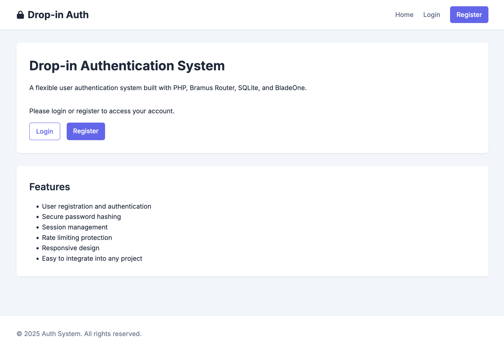

# Drop-in Auth System

A lightweight, single-file PHP authentication system using Bramus Router for routing, SQLite for data storage, and BladeOne for templating.

## Features

- **User Authentication**: Complete registration, login, and logout functionality
- **Rate Limiting**: Protection against brute force attacks and abuse
- **Session Management**: Secure user sessions with proper handling
- **Responsive Design**: Modern UI that works on all devices
- **SQLite Database**: Self-contained database requiring no external setup
- **BladeOne Templates**: Clean separation of logic and presentation
- **Single-File Architecture**: Everything packaged in one file for easy deployment

## Preview



## Requirements

- PHP 7.4 or higher
- SQLite extension
- Composer for dependency management

## Installation

1. Create a new project directory:

```bash
mkdir drop-in-auth
cd drop-in-auth
```

2. Initialize Composer:

```bash
composer init --no-interaction
```

3. Install dependencies:

```bash
composer require bramus/router eftec/bladeone
```

4. Save the `index.php` file in your project directory

   - The system will automatically create required directories and database

5. Run the PHP development server:

```bash
php -S localhost:8000
```

6. Visit `http://localhost:8000` in your browser

## Configuration

The following settings can be adjusted in the `Auth` class:

```php
private $maxAttempts = 5; // Maximum login attempts allowed
private $timeWindow = 15; // Time window in minutes for rate limiting
```

## Directory Structure

On first run, the system will create:

```
/
├── index.php             # The complete application
├── auth_system.db        # SQLite database (created automatically)
├── vendor/               # Composer dependencies
└── views/                # BladeOne templates (created automatically)
    ├── layout.blade.php
    ├── home.blade.php
    ├── login.blade.php
    ├── register.blade.php
    ├── dashboard.blade.php
    └── cache/            # Template cache directory
```

## Security Features

### Rate Limiting

The system implements IP-based rate limiting with the following features:

- Tracks login attempts by IP address and email
- Limits attempts to a configurable number within a time window
- Shows remaining attempts to legitimate users
- Automatically cleans up old attempts
- Protects both login and registration endpoints

### Password Security

- Passwords are hashed using PHP's `password_hash()` with the default algorithm
- Password verification uses `password_verify()` for secure comparison

## Customization

### Styling

The system uses a clean CSS design with the Inter font family. You can modify the styling in the `getLayoutTemplate()` method in the `App` class.

### Routes

Routes are defined in the `setupRoutes()` method of the `App` class. You can add or modify routes as needed.

## License

MIT
